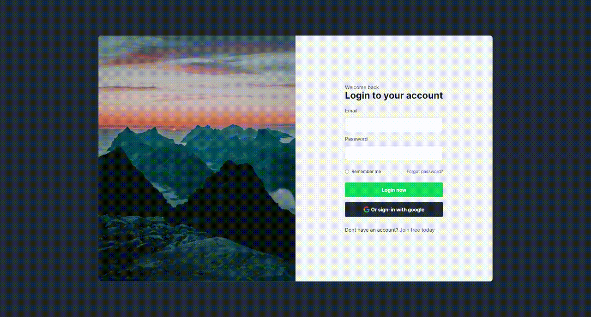

<h1 align="center">
Login Screen
</h1>

Login screen made during studies on tailwind css and framer motion 

## Participants

[Gabriel do Prado](https://github.com/praadin)

## Techs

- [x] NextJs
- [x] ReactJs
- [x] Tailwind CSS
- [x] Framer Motion

## Starting Dev Environment

1. Run `npm install` or `yarn install`. 
2. Run `yarn start` and acces `http://localhost:3000`. 

